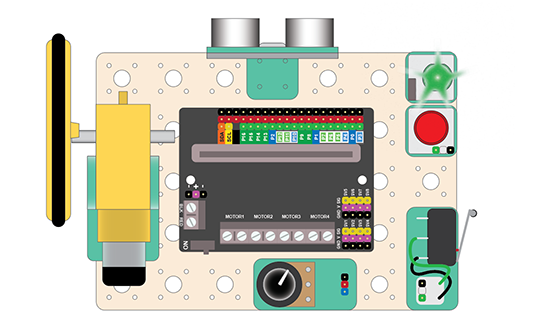
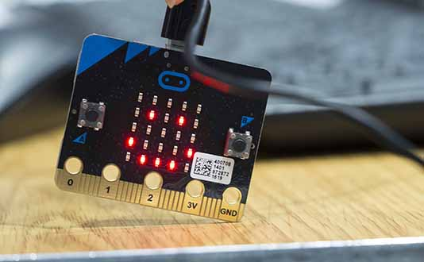
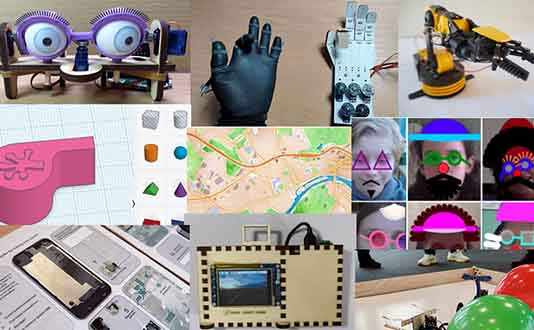
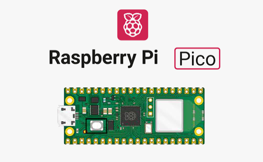

# Llewelyn Fernandes

Please see my website for details of courses and workshops I run in creative computing as well as supporting resources:

 
https://www.thinkcreatelearn.co.uk

Feel free to contact me on LinkedIn:

 
https://www.linkedin.com/in/llewelynfernandes

## Key Repositories

### BitMakeLab
Projects and other resources for the BitMakeLab digital making kit.

https://github.com/lewfer/BitMakeLab

### Microbit Extensions

#### DF Robot Motor Controller Extension (for BitMakeLab)
https://github.com/lewfer/mb-motors

#### 7-segment LED Display Extension 
https://github.com/lewfer/mb-numeric-led

#### Remote Controller Extension (ElecFreaks v1)
Sends radio messages based on remote control joystick and button actions. 
https://github.com/lewfer/mb-remote-control

#### Remote Receiver Extension 
Receives radio messages from remote control. 
https://github.com/lewfer/mb-remote-receiver

#### Mechanical Eyes Extension (Crickit version)
https://github.com/lewfer/mb-eyes-crickit

#### Crawlbot Extension (Kitronik version)
https://github.com/lewfer/mb-crawlbot-kitronik

#### Creatures Workshop Extension 
https://github.com/lewfer/mb-creatures

#### Renewable Energy Workshop Extension 
https://github.com/lewfer/mb-renewable-energy

### Workshops

#### Jetson Nano Self-driving car Workshop
https://github.com/lewfer/GIC-JetsonNano-Self-Driving-Car

#### Trains Bootcamp
https://github.com/lewfer/Robotics-Pico-Trains-Bootcamp

#### Robotics with Raspberry Pi Pico
https://github.com/lewfer/Robotics-Design-Build-Code-RPi-Pico

#### Plant Harvester
https://github.com/lewfer/GIC-Pico-Sustainability-Plant-Harvester

### Pico Recipes

#### Raspberry Pi Pico Receipes (Circuitpython)
https://github.com/lewfer/Digital-Making-RPi-Pico-Circuitpython

#### Raspberry Pi Pico Recipes (Micropython)
https://github.com/lewfer/Digital-Making-RPi-Pico-Micropython

