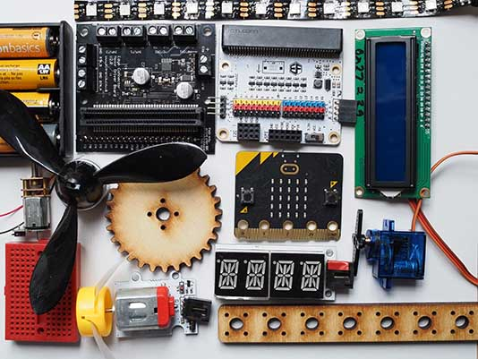

# Llewelyn Fernandes

Please see my website for details of courses and workshops I run in creative computing as well as supporting resources:

 
https://www.thinkcreatelearn.co.uk

Feel free to contact me on LinkedIn:

 
https://www.linkedin.com/in/llewelynfernandes

## BitMakeLab
Projects and other resources for the BitMakeLab digital making kit.

https://github.com/lewfer/BitMakeLab

## Microbit Extensions

### DF Robot Motor Controller Extension (for BitMakeLab)
https://github.com/lewfer/mb-motors

### 7-segment LED Display Extension 
https://github.com/lewfer/mb-numeric-led

### Alphanumic LED Display Extension
https://github.com/lewfer/mb-alpha-led

### Remote Controller Extension (ElecFreaks v1)
Sends radio messages based on remote control joystick and button actions. 
https://github.com/lewfer/mb-remote-control

### Remote Receiver Extension 
Receives radio messages from remote control. 
https://github.com/lewfer/mb-remote-receiver

### Mechanical Eyes Extension (Crickit version)
https://github.com/lewfer/mb-eyes-crickit

### Crawlbot Extension (Kitronik version)
https://github.com/lewfer/mb-crawlbot-kitronik

### Creatures Workshop Extension 
https://github.com/lewfer/mb-creatures

### Renewable Energy Workshop Extension 
https://github.com/lewfer/mb-renewable-energy

## Workshops

### P5 Art
https://github.com/lewfer/P5-Art

### P5 Chatbot
https://github.com/lewfer/P5-Chatbot

### P5 Doodle Classifier
https://github.com/lewfer/P5-Doodle-Classifier

### P5 Dress your Face
https://github.com/lewfer/P5-Dress-Your-Face

### P5 Gesture Control
https://github.com/lewfer/P5-Gesture-Control

### P5 Maps
https://github.com/lewfer/P5-Maps

### P5 Music Visualisation
https://github.com/lewfer/P5-Music-Visualisation

---

### Data Visualisation with P5
https://github.com/lewfer/Data-Visualisation-P5

### Data Visualisation with D3
https://github.com/lewfer/Data-Visualisation-D3

---

### Data Science Introduction
https://github.com/lewfer/Data-Science-Introduction

---

### Robotics with Raspberry Pi Pico
https://github.com/lewfer/Robotics-Design-Build-Code-RPi-Pico

### Robotics with the Raspberry Pi
https://github.com/lewfer/Robotics-Design-Build-Code-RPi

### Crawler Robot with the Microbit
https://github.com/lewfer/Robotics-Microbit-Crawler

### Mechanical Eyes with the Microbit
https://github.com/lewfer/Robotics-Microbit-Eyes

### Remote Robotic Hand with the Microbit
https://github.com/lewfer/Robotics-Microbit-Remote-Hand

### Web Controlled Robot
https://github.com/lewfer/Robotics-Web-Controlled-Robot
https://github.com/lewfer/Robotics-Web-Controlled-Robot-Full

---
### Tilting Maze Workshop
https://github.com/lewfer/Other-Microbit-Tilting-Maze

### Raspberry Pi Camera Workshop
https://github.com/lewfer/Other-RPi-Camera

## Girls into Coding Workshops
### Jetson Nano Self-driving Car Workshop
https://github.com/lewfer/GIC-JetsonNano-Self-Driving-Car

### Trains Bootcamp
https://github.com/lewfer/Robotics-Pico-Trains-Bootcamp

### Plant Harvester Workshop
https://github.com/lewfer/GIC-Pico-Sustainability-Plant-Harvester

### Renewable Energy Workshop
https://github.com/lewfer/GIC-Microbit-Energy

### Electric Bicycle Workshop
https://github.com/lewfer/GIC-Pico-Bicycle

## Digital Making Recipes

### Raspberry Pi Pico Receipes (Circuitpython)
https://github.com/lewfer/Digital-Making-RPi-Pico-Circuitpython

### Raspberry Pi Pico Recipes (Micropython)
https://github.com/lewfer/Digital-Making-RPi-Pico-Micropython

### Arduino Recipes
https://github.com/lewfer/Digital-Making-Arduino

### Raspberry Pi Recipes
https://github.com/lewfer/Digital-Making-RPi

